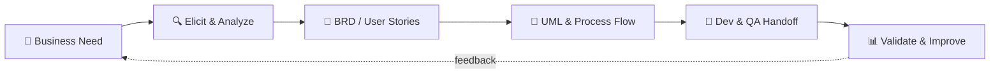

<!-- ═══════════════ HEADER ═══════════════ -->
<p align="center">
  
</p>

<h1 align="center">Hi there 👋, I'm Hai Linh</h1>

<p align="center">
  <a href="https://github.com/Hailinh1509">
    
  </a>
</p>

<p align="center">
  
  
  
</p>

<p align="center">
  
  
</p>


## 💡 About Me

<table align="center">
<tr>
<td>

```text
🎓 Education   : Management Information Systems @ Banking Academy
💼 Aspiring    : IT Business Analyst (system analysis & digital products)
🧠 Learning    : SQL · Agile · UML · BRD · User Stories
🔍 Interested  : Bridging business needs ↔ technical solutions
⚙️ Passionate  : Process improvement & structured system design
🎯 Looking for : BA · BA Support · Tester · Customer Success (product-driven teams)
```

</td>
</tr>
</table>


## 🧭 How I Work




## 🎯 Roles I Can Take

<div align="center">

| 📋 Business Analyst | 🛟 BA Support | 🐛 Tester / QA | 🤝 Customer Success |
|:---:|:---:|:---:|:---:|
| Elicit & analyze requirements | Support BAs with documentation | Write test cases & scenarios | Onboard & support SaaS users |
| BRD, User Stories, UML | Process maps, meeting notes, backlog upkeep | UAT, bug reporting, regression | Gather feedback & turn it into requirements |
| Bridge business ↔ dev team | Data lookup with SQL | Verify against acceptance criteria | Keep customers adopting & renewing |

</div>


## 🛠 Core Focus

<div align="center">

| 📋 Requirements | 🧩 Modeling | 🔄 Delivery | 🗄️ Data | 📱 Product |
|:---:|:---:|:---:|:---:|:---:|
| Business Requirement Analysis | UML, Process Flow | Agile & Scrum | SQL & Database | Digital Products & SaaS |
| BRD, User Stories | Use Case, Activity, Sequence | Sprint, Backlog | Query & Data Understanding | Product Thinking |

</div>

### 🧰 Tools & Tech

<p align="center">
  
</p>


## 📶 Skill Meter

<div align="center">

| Skill | Level | Progress |
|:---|:---:|:---|
| 📋 Requirement Analysis (BRD, User Stories) | Intermediate |  |
| 🧩 UML & Process Modeling | Intermediate |  |
| 🗄️ SQL & Database | Learning |  |
| 🔄 Agile & Scrum | Learning |  |
| 🐛 Testing (test cases, UAT, bug report) | Learning |  |
| 🤝 Customer Communication | Intermediate |  |

</div>

> 💬 Mức độ là tự đánh giá hiện tại — mình đang học và cập nhật mỗi tuần.


## 📊 GitHub Analytics

<p align="center">
  
  
</p>

<p align="center">
  
</p>

### 🏆 Trophies

<p align="center">
  
</p>

### 🧮 Profile Summary

<p align="center">
  
</p>

<p align="center">
  
  
</p>

<p align="center">
  
  
</p>

### 📈 Contribution Graph

<p align="center">
  
</p>

### 🐍 Contribution Snake

<p align="center">
  <picture>
    <source media="(prefers-color-scheme: dark)" srcset="https://raw.githubusercontent.com/Hailinh1509/Hailinh1509/output/github-snake-dark.svg" />
    <source media="(prefers-color-scheme: light)" srcset="https://raw.githubusercontent.com/Hailinh1509/Hailinh1509/output/github-snake.svg" />
    
  </picture>
</p>


## 🎯 Career Direction

<p align="center">
  
</p>


## 🔗 Let's Connect!

<p align="center">
  <a href="mailto:hailinhnt1509@gmail.com">
    
  </a>
  <a href="https://www.linkedin.com/in/YOUR-LINKEDIN-ID">
    
  </a>
  <a href="https://www.facebook.com/nai.ngoc.503">
    
  </a>
  <a href="https://YOUR-PORTFOLIO-LINK">
    
  </a>
</p>

<p align="center">
  <b>⭐️ Open to Business Analyst, BA Support, Tester and Customer Success opportunities (internship / junior) in product-driven environments.</b>
</p>

<!-- ═══════════════ FOOTER ═══════════════ -->
<p align="center">
  
</p>
